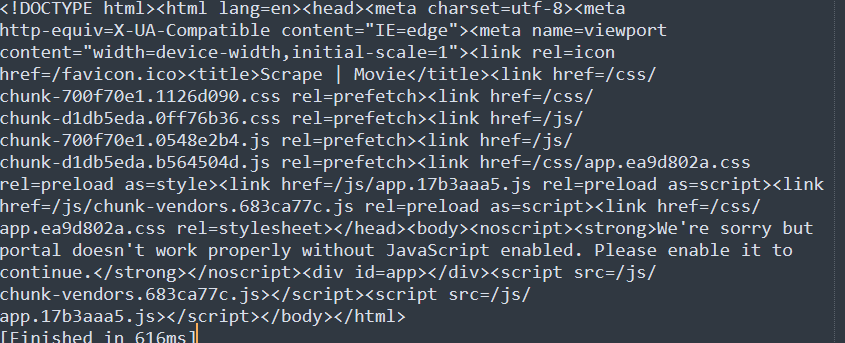

# 4.2 Selenium使用

## 4.2.1 为什么使用Selenium？

&emsp;&emsp;在爬取网站中，会遇到JavaScript动态渲染的界面, 例如利用Ajax获取的数据、使用JavaScript动态生成页面的某些元素,
使用Requests方式，很难拿到其中的数据。下面来看下例子。下面网站的的数据是通过Ajax接口获得，然后通过JavaScript动态加载出来的。

```python
import requests

response = requests.get('https://spa1.scrape.center/')
print(response.status_code)
print(response.text)
```

&emsp;&emsp;运行上面这段代码，可以看到下面的结果。

  

&emsp;&emsp;分析上面结果看到，请求网站是成功的，但没有像以前的请求的网站获得源代码，只是获得没经过 JavaScript 加载的页面源代码，这样的页面源代码是获取不到想要的数据。对于这种网站，可以继续使用 Requests 进行请求，但需要去破解 Ajax 接口的加密逻辑才能获得。对于简单的加密，Requests 还可以继续使用，而难度很大的，就可以使用 Selenium。

&emsp;&emsp;使用 Selenium ，就不需要再破解 Ajax接口的逻辑，获得加载后页面的源代码，这时再通过网页解析，就能获得页面的数据。

## 4.2.2 Selenium使用

### 4.2.2.1 导航
1. 打开网站

```python
from selenium import webdriver

driver = webdriver.Edge()
driver.get("https://spa1.scrape.center/")
```

2. 返回上一级

```python
driver.back()
```

3. 向前

```python
driver.forward()
```

4. 刷新

```python
driver.refresh()
```

### 4.2.2.2 Cookies

1. 添加Cookie

```python
driver.add_cookie({"name":"key","value":"value"})
``` 

2. 获取Cookie

```python
driver.get_cookie("key")
```

3. 获取Cookies

```python
driver.get_cookies()
```

4. 删除Cookie

```python
driver.delete_cookie("key")
```

### 4.2.2.3 选择元素
&emsp;&emsp;在Selenium中，支持多种选择元素的方式。例如XPATH,CSS选择器，CLASS_NAME选择，ID选择，LINK_TEXT(链接文本)选择,NAME(NAME属性)选择,TAG_NAME(标签名称)选择
1. 选择单个元素

```python
from selenium import webdriver
from selenium.webdriver.common.by import By

driver = webdriver.Edge()
id_element = driver.find_element(By.ID,'id')
class_element = driver.find_elenmnt(By.CLASSS,'class')
xpath_element = driver.find_element(By.XPATH,'XPATH语句')
```

2.选择多个元素

```python
from selenium import webdriver
from selenium.webdriver.common.by import By

driver = webdriver.Edge()
id_elements = driver.find_elements(By.ID,'id')
name_elements = driver.find_elements(By.NAME,'name')
```

3. 相对选择元素

&emsp;&emsp;如果在定位某个元素时，不太好定位，可以尝试使用相对定位选择元素.
```python
from selenium.webdriver.support.relative_locator import local_with
from selenium.webdriver.common.by import By
# 某元素的上方
above_element = locate_with(By.ID,'id').above({By.ID:"id"})
# 某元素的下面
below_element = locate_with(By.ID,'id').below({By.ID:"id"})
# 某元素的左面
left_element = locate_with(By.ID,'id').to_left_of({By.ID:"id"})
# 某元素的右面
right_element = locate_with(By.ID,'id').to_right_of({By.ID:"id"})
```

### 4.2.2.4 与元素交互

&emsp;&emsp;每个元素只能执行5个基本命令，click,sed keys,clear,submit select.

1. click

```python
from selenium import webdriver
from selenium.webdriver.common.by import By

driver = webdriver.Edge()
id_element = driver.find_element(By.ID,'id')
id_element.click()
```

2. send_keys

```python
from selenium import webdriver
from selenium.webdriver.common.by import By
from selenium.webdriver.common.keys import Keys

driver = webdriver.Edge()
id_element = driver.find_element(By.ID,'id')
id_element.send_keys("admin")

#具体的按键
id_element.send_keys(Keys.ENTER)
``` 

3. 清除元素可编辑内容

```python
id_element.clear()
```

4. 提交表单(不太推荐使用)

```python
id_element.submit()
```

### 4.2.2.5 等待

&emsp;&emsp;在使用Selenium中，我们可能会遇到元素找不到的情况，但在本地浏览情况下，可以看到此元素。这时，就需要等待。对于为什么需要等待背后的机制，还需要小伙伴自己查找下文档。

1. 显式等待

```python
from selenium.webdriver.support.wait import WebDriverWait
from selenium.webdriver.common.by import By
from selenium.support import expected_conditions as EC


driver = webdriver.Edge()
# until：若10s内元素加载出来，则不报错。超过10s,则报错
element = WebDriverWait(driver,timeout=10).until(lambda x: x.find_element(By.ID,'id'))

# until_not：与until相反
element = WebDriverWait(driver,timeout=10).until_not(lambda x: x.find_element(By.ID,'id'))

# 在selenium中，内置了一些等待条件，具体可查看官方的文档
element = WebDriverWait(driver,timeout=10).until(EC.presence_of_element_located((By.ID,'id')))
```

2. 隐式等待

&emsp;&emsp;当隐式等待，当查找的节点没有立即出现，会等待设定的时间。如超过时间，仍没有查找到，则会抛出异常。
```python
driver = webdriver.Edge()
driver.implicity_wait(10)
```

### 4.2.2.6 执行JavaScript
&emsp;&emsp;有些特殊的操作并没有提供接口，我们就可以模拟运行JavaScript。

```python
from selenium import webdriver

driver = webriver.Edge()
driver.execute_script('#JavaScript代码')
```

## 4.2.3 小节
&emsp;&emsp;本节学习了一些Selenium的操作，并没有开始编写爬虫，同时有的内容没有介绍到，将在后面的小节中继续介绍。

- 参考内容
    - Python3网络爬虫开发实战第二版
    - [Selenium官方文档](https://www.selenium.dev/)