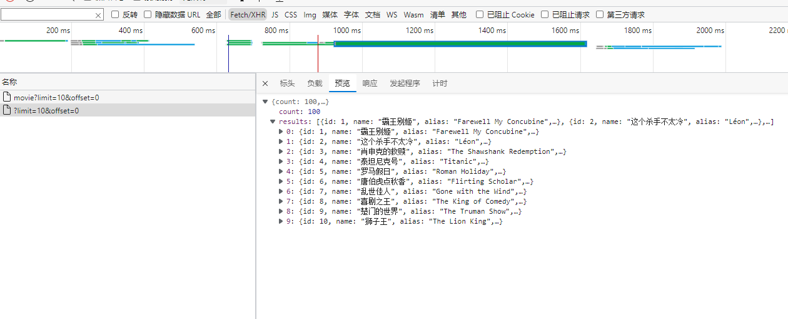

# 4.3 Selenium爬虫实战

## 4.3.1 分析需求

&emsp;&emsp;在任何一个爬虫程序编写之前，你应该想清楚抓取什么网站？用什么来抓取？要抓取什么数据？数据的保存格式是怎样的？下面是本次实战的需求

- 网站：https://spa1.scrape.center/
- 工具：Selenium
- 数据：抓取每个电影的电影名，上映时间，类别，评分，封面地址，详情页的网址。
- 数据格式：json数据格式

## 4.3.2 查看网站

&emsp;&emsp;在编写之前，需要观察页面的 url 和页面数据的获取方式。在前面已经提到，这个页面的数据是通过 Ajax
拿到的，然后通过JavaScript 渲染后呈现在眼前的。可以通过开发者工具，可以查看到。


&emsp;&emsp;点开详情页，通过浏览器开发者工具，也可以看到，数据获取也是通过 Ajax获得。既然知道了数据的获取方式，就需要了解网站的翻页逻辑。点击翻页按钮，可以看到原先的https://spa1.scrape.center/page/1 已经变为 https://spa1.scrape.center/page/2 ，再继续观察其他页面的url，发现分页的url是有规律的，每个网页的分页都是 https://spa1.scrape.center/page/页数 。因此，就可以构造出这些页面的url进行爬取。

&emsp;&emsp;分析了网站，就可以正式编写爬虫代码了。

## 4.3.3 代码编写

1. 导入我们需要的包

```python
from selenium import webdriver
from selenium.webdriver.common.by import By
from selenium.webdriver.support.wait import WebDriverWait  # 用于显示等待
from selenium.webdriver.support import expected_conditions as EC
from selenium.common.exceptions import TimeoutException
import json  # 用于处理json数据
import os
import logging
```

2. 设置全局变量

```python
BASE_URL = 'https://spa1.scrape.center/page/{page}'
# 设置存储目录
RESULTS_DIR = 'result'
# 设置抓取的页数
ALL_PAGE = 10
# 设置等待时间
TIMEOUT = 10
logging.basicConfig(level=logging.INFO)
```
3. 初始化webdriver对象，这里我用的是Edge浏览器，其他的可以自行更改。
```python
driver = webdriver.Edge()
# 由于需要等待网页元素的加载，使用webDriverWait。
wait = WebDriverWait(driver,timeout=TIMEOUT)
```

4. 编写请求页面的函数

```python
def request_page(url, location, condition):
    """func：用于请求每个页面
       url:页面的url
       location:页面某个元素的位置
       condition：等待条件"""
    try:
        # 请求页面
        driver.get(url)
        # 设置等待
        wait.until(condition(location))
        # 若出现报错，日志打印信息
    except TimeoutException:
        logging.error('请求 %s 错误',url,exc_info=True)
```

5. 编写请求分页的函数

```python
def request_index(page):
    """func:请求分页
       page:每个分页的页数"""
    page_url = BASE_URL.format(page = page)
    request_page(page_url,location=(By.XPATH,'//*[@id="index"]/div[1]/div[1]/div//a'),condition=EC.presence_of_element_located)
```
&emsp;&emsp;这里的presence_of_element_located
意思是等待所有节点都出现，官网中，还提供了其他额外的等待条件，详情请访问[Seleniumapi文档](https://www.selenium.dev/selenium/docs/api/py/webdriver_support/selenium.webdriver.support.expected_conditions.html#module-selenium.webdriver.support.expected_conditions)

6. 提取详情页的url

&emsp;&emsp;查看网站，发现每个详情页的 url 在 a 标签下的 href 属性中，需要提取详情页的 url。
//*[@id="index"]/div[1]/div[1]/div[1]/div/div/div[1]/a
```python
def parse_href():
    """提取每个电影详情页的url"""
    # 寻找分页中的所有电影所在的div下的a标签，大家可以自行查看
    elements = driver.find_elements(By.XPATH,'//*[@id="index"]/div[1]/div[1]/div/div/div/div[1]/a')
    for element in elements:
        yield element.get_attribute('href')
    
```

7. 提取详情页中的数据

```python
def parse_detail(url):
    """func:提取详情页中的数据
       url:详情页的url"""
    # 请求页面
    request_page(url,location=(By.XPATH,'//*[@id="detail"]/div[1]/div/div/div[1]/div/div[2]/a/h2'),condition = EC.presence_of_element_located)
    name = driver.find_element(
        By.XPATH, '//*[@id="detail"]/div[1]/div/div/div[1]/div/div[2]/a/h2').text
    class_list = driver.find_elements(
        By.XPATH, '//*[@id="detail"]/div[1]/div/div/div[1]/div/div[2]/div[1]//span')
    classs = [i.text for i in class_list]
    image = driver.find_element(By.CSS_SELECTOR, '.cover').get_attribute('src')
    time = driver.find_element(
        By.XPATH, '//*[@id="detail"]/div[1]/div/div/div[1]/div/div[2]/div[3]/span').text
    score = driver.find_element(By.CSS_SELECTOR, '.score').text
    return {
        'url':url,
        'name':name,
        'classs':classs,
        'image_url':image,
        'time':time,
        'score':score
    }
```
&emsp;&emsp;这时，抓取详情页的代码就结束了。上面用了两种查找元素的方法，自己可以对着网页结构的源代码自己进行更改。

8.保存数据

```python
# 创建文件夹
if not os.path.exists(RESULTS_DIR):
    os.makedirs(RESULTS_DIR)


def save_data(data):
    """func：用于保存数据
       data:parse_detail返回的数据"""
    name = data.get('name')
    data_path = f'{RESULTS_DIR/{name}.json'
    json.dump(data,open(data_path,'w',encoding='utf-8'),ensure_ascii=False,
              indent=2)
```

9. 编写运行代码
```python
if __name__ == '__main__':
    for i in range(1,ALL_PAGE + 1):
        request_index(i)
        detail_list = parse_href()
        for detail_url in list(detail_list):
            result = parse_detail(detail_url)
            save_data(result)
    driver.close()
```
10. 完整代码

&emsp;&emsp;代码编写已经完成，查看完整代码点击[完整代码](https://xiaobi891292.github.io/web-crawler/#/codes/ch04/section3.md)

## 4.3.4 小结
&emsp;&emsp;本小节通过一个练习项目来具体学习 Selenium 在网络爬虫的应用。大家多多练习，早日掌握 Selenium。可能还有许多应用没有讲到，大家还是要多多探索。

- 参考资料
  - 《pyhon3网络爬虫实战第二版》
  - [Selenium官方文档](https://www.selenium.dev/)